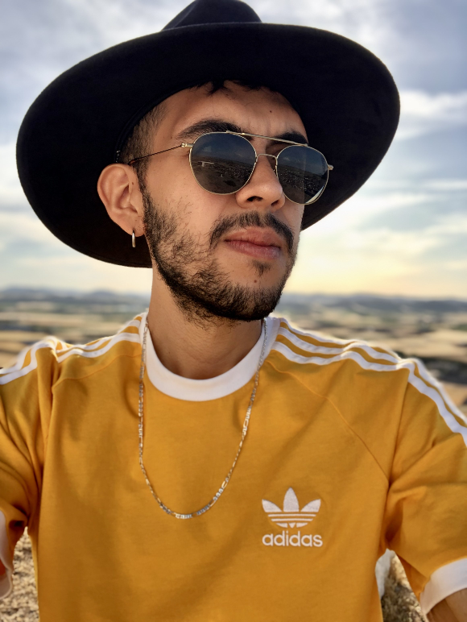

# Práctica 1

## Datos Personales

**Nombre**: Leonardo Ramírez Gutiérrez

**Edad**: 26 años

## Acerca de mí

Actualmente estoy estudiando la carrera de _Desarrollo de Software_ en el _Instituto AMERIKE_. También soy Lic. en Ingeniería Biomédica, estudié la carrera en la _UVM_ y egresé en 2021. 

La Ingeniería Biomédica nunca me acabó de gustar, sobre todo el campo laboral, por lo que realmente nunca ejercí mi profesión. Trabajé un par de meses en un _call center_ de _Aeroméxico_ hasta que decidí perseguir mis sueños y entré a estudiar mi segunda carrera. Los videojuegos me han apasionado desde siempre y la programación es algo que también me encanta, por lo que creo que tomé una buena decisión en estudiar esta carrera. 

Al egresar, espero poder tener los conocimientos y las habilidades suficientes como para entrar a trabajar a alguna empresa desarrolladora de videojuegos. Mi sueño es poder trabajar algún día como desarrollador en _Riot Games_. Por otra parte, también me interesa el desarrollo _indie_, ahora que lo entiendo un poco más y comprendo lo complejo y abrumador que es su trabajo, lo veo como un reto interesante y espero algún día poder desarrollar algo totalmente por mi cuenta.

## Mis pasatiempos

Mi pasatiempo favorito evidentemente es jugar videojuegos. Me gustan la mayoría de los géneros pero mis favoritos son los _shooters_ y los _survivals_. Normalmente son los 2 tipos de juegos a los que más les dedico tiempo ya que me gusta mucho practicarlos e ir mejorando en ellos. Actualmente mis 2 videojuegos favoritos son _Valorant_ (_shooter_) y _Valheim_ (_survival_).

También tengo otros hobbies, tales como ver películas o series, salir con mis amigos o ir de viaje. Viajar es una de las cosas que más disfruto, afortunadamente he tenido la oportunidad de viajar a diferentes partes del mundo. He viajado a China, Inglaterra, España y Estados Unidos. Considero que viajar te enriquece de experiencias y momentos inolvidables, espero poder conocer muchos más países pronto.

## Contacto

Correo: leoragut@gmail.com

Redes sociales:
  - [Instagram](https://www.instagram.com/leoragut/)
  - [Twitter](https://twitter.com/LeeonDeChino)
  - [Twitch](https://www.twitch.tv/leeondechino)